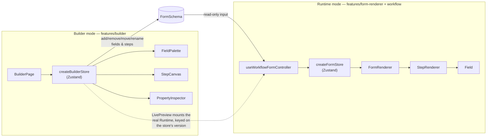
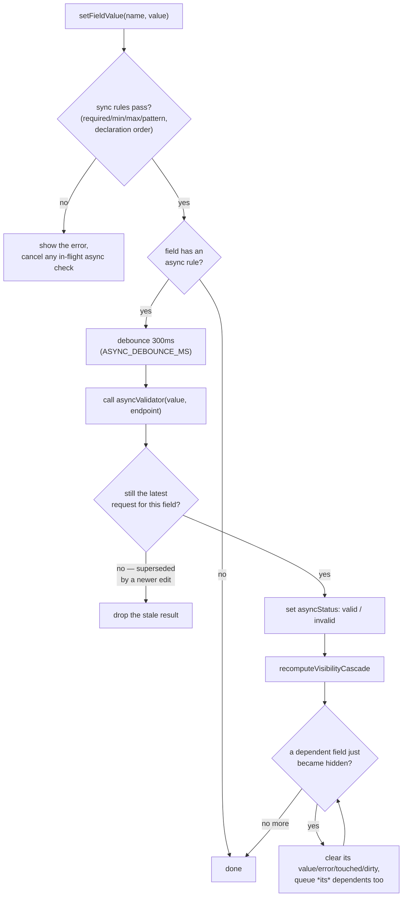

# Form & Workflow Builder

A configurable, metadata-driven, multi-step form builder: a drag-and-drop
dashboard for building forms as data, plus the runtime that renders and
validates them. Both halves consume the same `FormSchema` — the builder
has no rendering logic of its own, and the runtime has no editing logic
of its own; each is downstream of one shared contract.

> **Status: complete.** All 9 phases below have shipped. This README is
> that Phase 8 rewrite — an architecture write-up plus the case studies
> written along the way for the three phases where a real trade-off
> decision was actually made (the builder's dual drag/click affordance,
> the Phase 5 performance pass, and the Phase 6 coverage pass).

This project lives inside an npm-workspaces monorepo — see the
[root README](../README.md) for the workspace layout. Commands below
assume you're in this directory (`form-builder/`); the same scripts are
also reachable from the repo root via `npm run <script> --workspace=form-builder`.

## Roadmap

1. ~~Project scaffold: strict TS, ESLint/Prettier, Vitest, Playwright, CI~~
2. ~~Metadata-driven form schema & renderer~~
3. ~~State management & multi-step workflow engine~~
4. ~~Validation engine (sync, cross-field, async conditional)~~
5. ~~Drag-and-drop builder dashboard~~
6. ~~Performance tuning pass~~
7. ~~Test coverage (unit + integration + E2E)~~
8. ~~GitHub Actions CI (quality gate) + Vercel (build/deploy)~~ — done, ahead of schedule
9. ~~Case-study README (this file, rewritten)~~ (this phase)

## Architecture

### The shared contract: `FormSchema`

Everything in this project is downstream of one type, defined once in
[`src/types/schema.ts`](./src/types/schema.ts):

```
FormSchema { id, title, steps: StepSchema[] }
StepSchema { id, title, fields: FieldSchema[] }
FieldSchema {
  id, name, type, label, placeholder?, helpText?, defaultValue?,
  options?,                 // required for select/radio
  validation?: ValidationRule[],   // required / min / max / pattern / async
  visibleWhen?: ConditionExpression, // gates rendering on another field's
}                                    // value, or its async status
```

A field's `validation` and `visibleWhen` are _typed_ here but not
_interpreted_ here — `features/validation` is the only code that
evaluates them. That split is what let the builder (Phase 4) start
authoring these before Phase 3's engine existed to run them, and it's
what makes the two halves of this app genuinely independent rather than
independent-in-name: neither one imports anything from the other.

### Two modes, one schema, two independent stores



`createBuilderStore` and `createFormStore` are deliberately two separate
Zustand stores rather than one, because they answer two different
questions about the same schema: the builder store asks "what does this
form look like" (add a field, rename a step), and the workflow store
asks "what has this one visitor typed so far" (values, touched, dirty,
which step they're on). Sharing a store would mean either running a
whole fill-session's worth of state through every edit in the builder,
or vice versa — neither store needs to know the other exists, and
neither ever imports from the other's module.

`LivePreview` is the seam that proves this actually works end to end: it
mounts the _real_ `FormRenderer` + `useWorkflowFormController` — not a
mock — against the schema currently being edited, keyed on the builder
store's `version` counter so every edit remounts a fresh fill session.
(Editing the very field a live session was mid-fill on has no
well-defined "patch it in place" behavior, so a remount is the
deliberate choice, not an oversight — see [`LivePreview.tsx`](./src/features/builder/LivePreview.tsx).)

### The validation pipeline

The part of this project with the most actual engineering in it is
`createFormStore`'s `runValidation` → `scheduleAsyncValidation` →
`recomputeVisibilityCascade` chain — sync rules, a debounced/race-safe
async check, and a visibility cascade that has to terminate even if a
schema's `visibleWhen` conditions form a cycle:



Two details worth calling out because they're the kind of thing that
looks like over-engineering until you hit the case it's for:

- **Race safety.** Each field's async check carries a monotonically
  increasing request id (`asyncRequestIds`); a result only gets applied
  if its id still matches the latest one issued for that field. Typing
  `"PROMO1"` then `"PROMO2"` before the first check resolves means the
  first response — whichever order the two network calls actually land
  in — is silently discarded rather than briefly flashing a wrong
  status.
- **Cycle safety.** The cascade's `processed` set (a plain `Set<string>`
  of field names already handled this pass) exists because
  `visibleWhen` conditions can reference each other circularly — field A
  hidden when B is empty, B hidden when A is empty — and nothing in the
  schema's own type stops an author (human or imported JSON) from
  writing that. Without the guard, clearing one field cascades to the
  other, which cascades back to the first, forever. `createFormStore.validation.test.ts`
  builds exactly that circular schema and asserts the cascade still
  terminates — see the Phase 6 case study below for why that test didn't
  exist until this project went looking for it.

### A deliberate scope cut, noted rather than hidden

`createBuilderStore.moveFieldToStep` — moving a field from one step to
another — is implemented and unit-tested, but has no UI affordance.
`BuilderPage` only ever mounts _one_ step's canvas at a time (the
currently-selected tab), so there's no second drop target on screen to
drag a field onto, and a cross-step move was judged lower priority than
the phases that followed it. It's mentioned here rather than left
silent because a portfolio project's case study should say what was cut
and why, not just what shipped.

## Case studies

Three phases produced a real trade-off worth writing down — not "here's
what I built" but "here's the decision, the alternative, and why this
one won."

### Phase 4: the builder's dual drag/click affordance

`FieldPalette`'s entries are simultaneously a `@hello-pangea/dnd` drag
source and a plain `<button onClick>` that does the same thing. Dragging
is the interaction that makes a "drag-and-drop builder" look like one in
a demo; it's also the one WCAG 2.5.7 (Dragging Movements) requires a
single-pointer alternative to, because a drag gesture is unusable for
anyone who can't perform a sustained pointer-drag. The click path isn't
a degraded fallback bolted on for compliance — it's genuinely less
friction for the repetitive case ("add five text fields"), which is why
it's presented as an equal option (`Drag onto the canvas, or click to
add.`) rather than a hidden accessibility escape hatch. `StepTabs`
followed the same reasoning further: steps are reordered with ↑/↓
buttons only, no drag at all, because a form's steps are few and never
dragged _onto_ from anywhere else — a second `DragDropContext` would
have added real complexity (nested drag contexts, another set of
droppable ids) for an interaction two buttons already cover just as
well.

### Phase 5: performance tuning

The brief for this phase is "make it faster," which only means something
if there's a number attached. Two problems turned out to be real,
measured, and fixed; a third was investigated and turned out to already
be a non-issue, which is worth writing down too — not every suspicious
pattern is actually a bug.

#### 1. Code-splitting the two mutually-exclusive views

`App.tsx` shows exactly one of `RuntimeDemo` or `BuilderPage` at a time,
picked by a nav toggle that starts on `RuntimeDemo`. Both were plain
imports, so both — and everything they pull in, including
`@hello-pangea/dnd`, which only `BuilderPage` ever touches — shipped in
the one bundle every visitor downloaded before either view had rendered
a single node.

Switching both to `React.lazy` + a shared `Suspense` boundary split the
build into four chunks instead of one:

| Chunk         | Raw       | Gzip     | Loaded when                      |
| ------------- | --------- | -------- | -------------------------------- |
| `index`       | 193.26 kB | 61.17 kB | always (app shell + shared deps) |
| `RuntimeDemo` | 3.90 kB   | 1.55 kB  | the demo view mounts (default)   |
| `workflow`    | 12.34 kB  | 3.96 kB  | either view (shared controller)  |
| `builder`     | 114.67 kB | 34.17 kB | only once "Builder" is clicked   |

Before: one 322.27 kB / 98.59 kB gzip bundle, always. After: a visitor
who never opens the builder downloads `index` + `RuntimeDemo` +
`workflow` — about 209.5 kB / 66.7 kB gzip, a ~35% raw / ~32% gzip cut
— and the `@hello-pangea/dnd`-carrying `builder` chunk (a third of the
original bundle) never loads at all unless they click "Builder". The
numbers above are straight from `npm run build`'s own output, not an
estimate.

#### 2. A `memo` wrapper that wasn't doing anything

`FieldPalette`, `StepCanvas`, and `StepTabs` were all wrapped in
`React.memo` from the moment they were written in Phase 4 — and it had
no effect, because `BuilderPage` passed each of them a brand-new arrow
function as a prop on every render. `memo` bails out of a re-render only
when every prop is reference-equal to last time; a fresh function
identity fails that check regardless of what the function does, so the
wrapping was pure overhead (an extra comparison that always failed)
rather than the optimization it looked like.

The concrete cost: `FieldPalette` carries no data props at all — only a
callback — so it should be able to skip re-rendering (and, since each of
its 8 entries is a `@hello-pangea/dnd` `Draggable`, skip re-registering
8 drag handles) for almost any state change elsewhere in the builder.
Instead it re-rendered on _every_ keystroke anywhere, including typing
into a field's label or the form's title — edits with no possible effect
on what the palette shows.

The fix was mechanical: `BuilderPage`'s handlers now go through
`useCallback`, keyed on the active step id and the specific store
action(s) each one calls (both stable — see `createBuilderStore`'s doc
comment on why store actions don't change identity, and
`setFormMeta`/`updateField`'s structural sharing on why editing a title
or a field leaves _other_ steps' object references untouched). This is
checked directly, not taken on faith:
`src/features/builder/__tests__/renderIsolation.test.tsx` renders the
builder, adds a field, types into its label, types into the form title,
and asserts `FieldPalette`'s render count stays at 1 throughout — the
same "assert on a render counter, not DOM behavior" approach
`form-renderer/renderTracker.ts` already used for the Phase 1-3 render-
isolation claim.

`StepCanvas` legitimately re-renders while its own step's fields
change — the visible field-card labels really do need to update — so
there's no claim that panel goes to zero re-renders, only that it's no
longer re-rendering for reasons unrelated to what's on screen.

#### 3. What turned out not to be a problem

`StepTabs` receives `steps={builder.schema.steps}`, and that array gets
a brand-new reference on _every_ field edit (`updateField` rebuilds the
top-level `steps` array via `.map`, even when only one field on one
step actually changed) — so `StepTabs` re-renders on every keystroke
too, `memo` or not, and fixing that for real would mean a custom prop
comparator that diffs step id/title instead of trusting array identity.
That was deliberately left alone: `StepTabs` renders a handful of
buttons with no drag registration and no per-item work worth avoiding,
so the render is cheap regardless of whether it was "necessary" —
adding a custom comparator here would be complexity spent on a cost
that was never actually measurable.

The form-renderer/workflow layer (Phases 1-3) needed no changes at all
— it already followed the discipline this phase applied to the builder
(`Field.tsx` and `StepRenderer.tsx`'s doc comments describe it, and
`renderIsolation.test.tsx` in that feature already checks it), which is
exactly why the builder's version of the same test lives right next to
it now instead of being a one-off.

### Phase 6: test coverage

The brief for this phase is "test coverage (unit + integration + E2E)."
The easy way to satisfy that is to chase a percentage; the useful way is
to read what each uncovered line and branch actually _is_ before writing
a test for it, because a lot of "uncovered" code turns out to be one of
three very different things: a real behavioral gap worth closing, a
defensive guard that's structurally unreachable through the code's own
public contract, or a styling/DnD branch Playwright already exercises in
a real browser. Treating all three the same — either testing all of them
by force, or ignoring all of them because "the number's fine" — would
have been the wrong call either way.

#### Where coverage started

| Metric     | Before |  After |
| ---------- | -----: | -----: |
| Statements |  91.4% | 98.35% |
| Branches   |  79.1% |  93.4% |
| Functions  |  94.3% | 99.62% |
| Lines      |  90.6% | 98.25% |

(The "before" numbers are the whole-suite baseline at the start of this
phase, after Phase 5's own tests but before any Phase 6 gap-closing.)

#### What got closed, and why each one was worth writing

- **`createBuilderStore.ts`** (98.77%/94.73%, up from ~91%/79%): two
  actions — `renameStep` and `clearSelection` — had _zero_ test
  coverage and no UI affordance either, so nothing else in the suite
  exercised them by accident. Also closed: every guard branch across
  `addField`/`removeField`/`moveField`/`moveStep`/`moveFieldToStep`/
  `renameField`/`changeFieldType` for an invalid id, and the
  structural-sharing passthrough branches (editing a field in step A
  must leave step B's own field array _and_ its objects untouched —
  each of those got an explicit assertion, not just an implicit one).
- **`createFormStore.ts`** (100%/97.22%, up from ~92%/89%): the
  standout here is a genuine correctness guard, not busywork —
  `recomputeVisibilityCascade`'s `processed` set exists specifically to
  stop a circular `visibleWhen` dependency (field A hidden when B is
  empty, B hidden when A is empty) from looping forever. Nothing in the
  suite had ever constructed that scenario, so the guard had never
  actually been exercised; the new test builds exactly that circular
  schema and asserts the cascade still terminates. Also closed: the
  empty-value branch of `scheduleAsyncValidation` cancelling a still-
  pending debounce timer, the default-message fallback when an async
  check resolves invalid with no `message`, the `touched` ternary's
  already-touched branch, and `runValidation`'s guard against a field
  name absent from the schema.
- **`Field.tsx` / field controls** (100%/95.45%): clearing a text,
  textarea, or select field back to empty was only ever tested as
  "type a value in" — never "clear it back out" — which matters because
  the contract is specifically "empty reports `null`, not `''`" (that's
  what makes a `notEmpty` visibility condition or a `required` rule
  behave correctly). Also closed: a select/radio field rendered with no
  `options` key at all (an omitted array, not an empty one — a
  hand-authored or imported schema might not seed it), the checkbox
  variant's own `aria-describedby` wiring to its error id (separate
  code path from `FieldWrapper`'s, since checkboxes skip that chrome
  entirely), and the "Checking…" status text actually rendering while
  an async rule is in flight.
- **`FormRenderer.tsx`**: the Next button's disabled "Checking…" label
  while an async check is pending had no direct test — every existing
  async test asserted on `asyncStatus` in the store, not on what the
  button actually displays.
- **`StepTabs.tsx` / `BuilderPage.tsx`**: `BuilderPage.test.tsx` had a
  "move step later" (↓) test but no "move step earlier" (↑) counterpart.
- **`syncRules.ts`**: `maxLength` and `max` each only had their
  _violation_ branch tested, never the passing case; `pattern`'s
  default-message fallback (no rule-supplied `message`) was untested
  too — the same shape of gap in three different rules.
- **`asyncValidator.ts`**: a non-string value reaching the mock
  validator (defensive — async rules only ever attach to text-like
  fields in practice) had no test confirming it resolves valid rather
  than throwing.
- **`fieldTypeMeta.ts`**: `labelForFieldType`'s fallback to the raw
  type string, for a type with no registered label — unreachable
  through the `FieldType` union at the type checker, but a schema
  loaded from disk isn't type-checked at runtime, so an unknown future
  type string reaching this function is a real (if rare) case.
- **`renderTracker.ts`** (both copies): the reset helpers were called
  in every test file's `beforeEach`, but always against an
  already-empty counter object on the first test, so the actual
  "delete stale keys" loop body had never run. Each file's suite grew a
  second test that asserts the reset actually clears counts a prior
  test left behind — a real regression check, not just a coverage
  formality.
- **E2E**: `e2e/builder.spec.ts` had drag/reorder and click-to-add
  covered, but nothing exercised removing a field, removing a step, or
  changing a field's type through the real browser UI. Added one test
  covering all three (deliberately click-driven, not drag-driven — no
  reason to pay the drag simulation's flakiness tax for interactions
  that are plain button clicks).

#### What was left as an accepted gap, and why

A handful of branches stayed uncovered on purpose rather than by
oversight:

- **Defensive guards that are structurally unreachable.**
  `createBuilderStore`'s `moveStep`/`moveField` both validate their
  index is in range _before_ calling `Array.splice`, so the follow-up
  `if (!moved)` check can never actually see `moved` be falsy — same
  story for `createFormStore.goToStep`'s `currentStep?.fields ?? []`,
  guarded by index clamping that already prevents `currentStep` from
  being `undefined`. Forcing these would mean mocking `Array.splice` or
  hand-corrupting internal state — testing the mock, not the code.
- **`NumberFieldControl`'s `Number.isNaN` branch.** In theory,
  unparseable text producing `NaN` should fall back to `null`. In
  practice, a real `<input type="number">` — including jsdom's, which
  this suite runs against — sanitizes its own `.value` to `""` for any
  string that isn't a valid intermediate number, so the branch can't be
  reached by typing into the actual control; it would need directly
  invoking the internal parser with a hand-crafted string, which tests
  the parser's contract in isolation rather than anything a user (or
  the browser standing in for one) can actually trigger.
- **DnD-only styling branches** — `FieldPalette`/`FieldCard`/
  `StepCanvas`'s `isDraggingOver`/`isDragging` CSS-class branches, and
  `BuilderPage`'s `handleDragEnd` body. These only run mid-gesture
  inside `@hello-pangea/dnd`'s own pointer-sensor lifecycle, which the
  Vitest/jsdom environment doesn't simulate — but `e2e/builder.spec.ts`
  drives real mouse events through a real browser and exercises this
  exact code path already. Unit-mocking the DnD library to force these
  branches in jsdom would test the mock's behavior, not the app's.
- **A few remaining `PropertyInspector.tsx` branches** (deep option/
  operator/value-editor conditionals) stayed as the one deliberately
  under-invested area of this pass — the file already has 19+ direct
  unit tests covering its primary behavior, and the remaining branches
  are narrow edge combinations judged lower value than the gaps above
  for the time this phase had.

Coverage thresholds in `vite.config.ts` were raised from 80/75/80/80 to
95/90/95/95 — a few points below the actual numbers rather than equal to
them, so a normal future change doesn't fail CI over noise, while still
locking in this phase's gains as a floor future work can't quietly
regress under.

#### One thing this phase found along the way

Not a coverage gap: running `tsc -b` as part of full CI (rather than
relying on `vitest run` alone, which type-checks more leniently)
surfaced a latent type error in `PropertyInspector.test.tsx` — its
`vi.fn()` mocks were typed too loosely to satisfy the component's actual
prop signatures. Harmless at runtime (the mocks worked fine), but it
meant `npm run build`'s own `tsc -b` step would have failed the moment
someone ran it clean. Fixed by typing each mock against
`PropertyInspectorProps` directly instead of a bare `ReturnType<typeof
vi.fn>`. A reminder that "the tests pass" and "the project type-checks"
are two different claims — this phase's `npm run ci` run is what caught
the gap between them.

## Stack

- [Vite](https://vite.dev) + React 19 + TypeScript (strict mode, plus the
  extra strictness flags `strict` alone doesn't enable — see
  `tsconfig.app.json`)
- [Zustand](https://github.com/pmndrs/zustand) for state
- [ESLint](https://eslint.org) (flat config, type-checked) + [Prettier](https://prettier.io)
- [Vitest](https://vitest.dev) + [Testing Library](https://testing-library.com) for unit/integration tests
- [Playwright](https://playwright.dev) for E2E

## Getting started

```bash
npm install
npm run dev
```

## Scripts

| Script                  | What it does                                   |
| ----------------------- | ---------------------------------------------- |
| `npm run dev`           | Start the Vite dev server                      |
| `npm run build`         | Type-check (`tsc -b`) and build for production |
| `npm run preview`       | Preview the production build locally           |
| `npm run lint`          | ESLint (type-checked)                          |
| `npm run lint:fix`      | ESLint with autofix                            |
| `npm run format`        | Prettier, writes changes                       |
| `npm run format:check`  | Prettier, check only (used in CI)              |
| `npm run typecheck`     | `tsc -b` with no emit                          |
| `npm run test`          | Vitest, single run                             |
| `npm run test:watch`    | Vitest, watch mode                             |
| `npm run test:coverage` | Vitest with coverage thresholds enforced       |
| `npm run test:e2e`      | Playwright E2E suite                           |
| `npm run test:e2e:ui`   | Playwright E2E suite, interactive UI mode      |
| `npm run ci`            | Everything CI runs, in one command             |

## Project structure

```
src/
  components/ui/       Shared, schema-agnostic UI primitives (Button,
                        TextInput, Select, RadioGroup, Checkbox,
                        FieldWrapper — presentational only)
  features/
    form-renderer/     Schema → DOM renderer (Phase 1, done)
      fieldRegistry.tsx    FieldType -> control component lookup table
      Field.tsx            Per-field orchestrator (memoized)
      StepRenderer.tsx      Renders one step's fields
      FormRenderer.tsx      Top-level; takes a FormController, knows
                             nothing about how state is managed
      renderTracker.ts     Per-field render counter used only by the
                            render-isolation test
      fields/               One control per FieldType
    workflow/           Multi-step navigation + store (Phases 2-3, done)
      types.ts              FormController contract (state + actions +
                             derived isDirty) — the shape form-renderer
                             consumes and knows nothing else about
      createFormStore.ts    Per-instance Zustand store factory: values,
                             errors, touched, dirty, asyncStatus,
                             visitedStepIndices; wires the validation/
                             module's pure functions in for sync rules,
                             visibility cascades, and debounced/
                             race-safe async checks; goToStep force-
                             validates + touches the current step's
                             visible fields on forward navigation only
      useWorkflowFormController.ts  React hook: one store per mounted
                                     instance via useState's lazy
                                     initializer, never a module-level
                                     singleton
    validation/         Sync/cross-field/async validation (Phase 3, done)
      syncRules.ts           required/min/max/length/pattern rule checks
      evaluateCondition.ts   visibleWhen conditions, incl. one field
                              gated on another's asyncStatus
      buildFieldIndex.ts     name -> field lookup + dependents graph,
                              used to cascade-clear hidden fields
      asyncValidator.ts      mock network validator (debounced,
                              simulated latency) fields' `async` rules
                              call through
      maskUntouchedErrors.ts hides an error until its field is touched,
                              so untouched-but-invalid fields stay quiet
    builder/            Drag-and-drop builder dashboard (Phase 4, done):
                        edits a FormSchema as data. A deliberately
                        separate store from workflow/'s — that one runs
                        a fill session against a schema, this one edits
                        the schema itself; they share only the
                        FormSchema contract.
      types.ts               BuilderState/BuilderActions contract
      createBuilderStore.ts  Per-instance Zustand store factory: add/
                              remove/move/rename fields and steps,
                              change a field's type, edit its
                              validation rules and visibleWhen
                              condition — keeps dangling visibleWhen
                              references clean when a field they depend
                              on is removed or renamed
      useBuilder.ts           React hook, same lazy-useState pattern as
                              useWorkflowFormController
      fieldTypeMeta.ts        Palette copy + defaults per FieldType
      validationRuleHelpers.ts  Pure helpers for reading/updating one
                                rule in a field's validation array
      resolveDragEnd.ts       Pure function: a DragDropContext
                              onDragEnd result -> an addField/moveField
                              action or null — extracted so every
                              branch is unit-testable without
                              simulating a real pointer drag
      FieldPalette.tsx        Field-type source list: drag onto the
                              canvas, or click to add (the WCAG 2.5.7
                              single-pointer alternative)
      StepCanvas.tsx          Active step's field list; drop target +
                              reorderable
      FieldCard.tsx           One field's row: drag handle + up/down/
                              remove button equivalents
      StepTabs.tsx            Step management via up/down/remove
                              buttons only (no drag — see the comment
                              in the file for why)
      PropertyInspector.tsx   Edits the selected field: label/name/
                              type/options/validation/visibility
      LivePreview.tsx         Mounts the real FormRenderer +
                              useWorkflowFormController against the
                              schema being built — proves the builder's
                              output is exactly what the runtime
                              consumes, not a mock
      SchemaJsonView.tsx      Raw FormSchema JSON, for the curious
      BuilderPage.tsx         Top-level: layout, DragDropContext,
                              output view switcher; its handlers are
                              memoized (Phase 5) so FieldPalette/
                              StepCanvas's `memo` wrapping is effective
      renderTracker.ts        Per-component render counter, mirroring
                              form-renderer's — used only by the Phase 5
                              render-isolation test
  types/schema.ts       FormSchema/StepSchema/FieldSchema — the contract
                        everything above renders from
  test/                Test setup
e2e/                   Playwright specs
vercel.json            Explicit build config for the Vercel deploy
```

CI (`.github/workflows/ci.yml`) lives at the monorepo root — see the root
README. Deployment is handled separately by Vercel's own GitHub
integration (Root Directory = `form-builder`), not by CI; `vercel.json` in
this folder pins the build command/output directory so that isn't left to
framework auto-detection.

## Environment / tooling notes

- Node version pinned via `.nvmrc` (22).
- `PLAYWRIGHT_CHROMIUM_EXECUTABLE_PATH` — optional env var read by
  `playwright.config.ts` to point Playwright at a pre-provisioned Chromium
  binary instead of downloading one. Not needed on a normal machine or in
  CI (`npx playwright install --with-deps` handles it there); useful in a
  sandboxed dev environment that ships its own browser at a fixed path.
